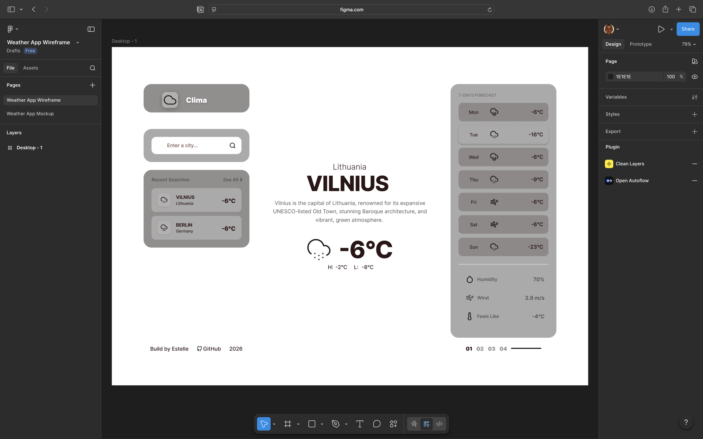

This structure keeps the project modular, scalable, and easy to maintain.

---

## 🖼️ Screenshots

---

## 🎯 Goals

- Improve my design‑to‑code workflow  
- Build clean, reusable UI components  
- Practice responsive design  
- Learn API integration  
- Document my development process publicly  

---

## 📬 Feedback

If you have suggestions or feedback, feel free to open an issue or reach out.  
This project is part of my learning journey, and I’m improving it step by step.

